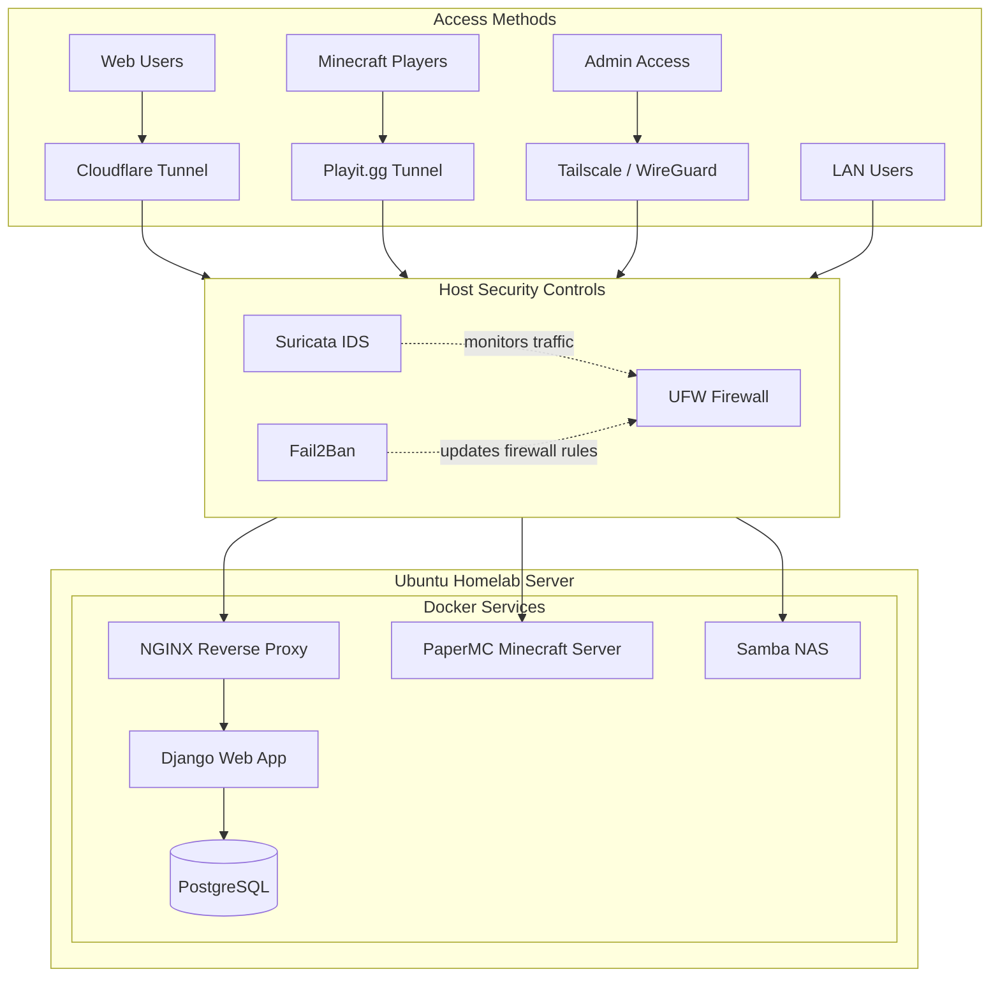
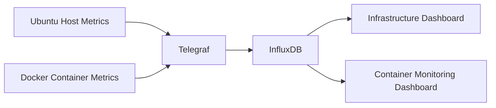
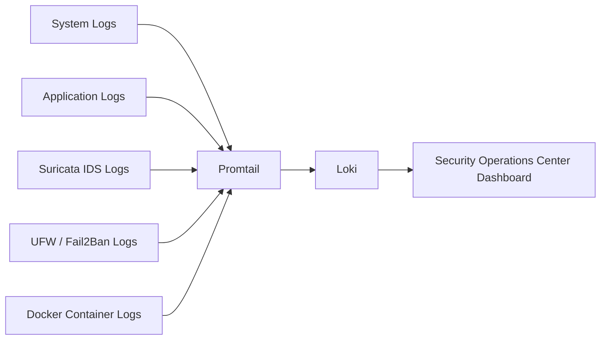

# HomeLabServer - Infrastructure and Security Project
As I've always been interested in servers, I decided to get some experience with them and finally build one myself. 

For this server, I decided to use an Ubuntu Linux server to host some containerized services, such as an NGINX web server, a NAS, and a Minecraft server (on limited resources). This Homelab was designed to securely host these services by minimizing the attack surface and public exposure, and including observability, centralized logging, and threat monitoring.

This homelab aims to simulate a production-style infrastructure, with practices like containerized applications, zero-trust system administration, centralized logging, intrusion detection, and monitoring dashboards.

---

## Technologies Used

<table width="100%">
  <tr>
    <td width="25%" valign="top">

### Operating System
- Ubuntu Linux Server

    </td>
    <td width="25%" valign="top">

### Infrastructure
- Docker  
- Docker Compose  
- NGINX  
- PostgreSQL  
- Samba  
- PaperMC  

    </td>
    <td width="25%" valign="top">

### Security
- Tailscale (WireGuard)  
- Cloudflare Tunnel  
- UFW  
- Fail2Ban  
- Suricata IDS  

    </td>
    <td width="25%" valign="top">

### Observability
- Telegraf  
- InfluxDB  
- Grafana  
- Loki  
- Promtail  

    </td>
  </tr>
</table>

# Server Architecture

# Security Architecture

Because this was my first time hosting services accessible from the public internet, one of my primary design goals was to minimize the attack surface and avoid direct exposure of my home network infrastructure.

Instead of relying on port forwarding, I designed the homelab around a layered security model that minimizes publicly exposed services and reduces the risk to both the server and my home router.

This approach uses:
- **Tailscale (WireGuard)** for Zero-Trust administrative access using identity instead of exposing SSH
- **Cloudflare Tunnel** to publish web services without revealing my public IP
- **Playit.gg tunneling** for the public Minecraft server without direct port forwarding
- **UFW** for traffic filtering
- **Fail2Ban** to respond to suspicious activity automatically
- **Suricata IDS** to detect threats and monitor activity

This design allowed me to host public-facing services while controlling exposure and reducing the attack surface of my home network. Additionally, I tracked the information generated by these technologies through dashboards.

---

# Monitoring & Observability

The homelab uses separate pipelines for metrics and log collection.

---

## Metrics Monitoring

Host and container metrics are collected with Telegraf, stored in InfluxDB, and visualized in Grafana.

### Dashboards

**Infrastructure Monitoring**

**Container Monitoring**

---

## Log Collection & Security Monitoring

System, application, container, and security logs are collected with Promtail, stored in Loki, and analyzed in Grafana.

### Dashboards

**Security Operations Center**

# Hosted Services

## Django Web Application
Self-hosted Python/Django application behind NGINX with PostgreSQL backend with a Cloudflare Tunnel.

---

## Samba NAS
Private network-attached storage for internal file sharing.

---

## Public Minecraft Server
Internet-accessible Minecraft server securely exposed through Playit.gg tunneling.

